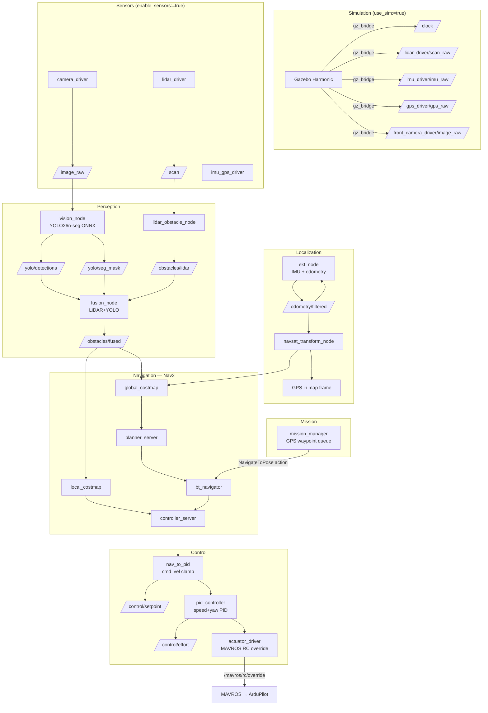

# Njord 2026

ROS 2 Jazzy autonomous surface vessel (ASV) stack for the [NODE Engineering Club](https://github.com/NODE-Engineering-Club) competition robot **Asket**.

## Getting Started

**Prerequisites (one-time install):**
1. [VSCode](https://code.visualstudio.com/)
2. [Docker Desktop](https://www.docker.com/products/docker-desktop/) — Windows / macOS. On Linux, Docker Engine or Podman works.
   - Linux/Podman: set `"dev.containers.dockerPath": "podman"` in VSCode user settings.
3. VSCode extension: [Dev Containers](https://marketplace.visualstudio.com/items?itemName=ms-vscode-remote.remote-containers)

**To start developing:**
1. Open this folder in VSCode
2. Click **Reopen in Container** when prompted (or `Ctrl+Shift+P` → *Dev Containers: Reopen in Container*)
3. First launch takes ~5 minutes to build. After that it's instant.

The `postCreateCommand` runs `colcon build --symlink-install` automatically and sources the workspace.

**Run the full stack (hardware):**
```bash
ros2 launch bringup njord.launch.py
```

**Run in simulation (Gazebo Harmonic):**
```bash
ros2 launch bringup njord.launch.py \
  use_sim:=true \
  enable_sensors:=false \
  enable_mavros:=false
```

This launches Gazebo with `basicWorld.sdf`, spawns the Asket URDF, bridges the sim clock, and runs the full navigation/control/mission stack against simulated sensor topics.

**Rebuild after adding new files** (`--symlink-install` means code edits don't need a rebuild for Python packages):
```bash
colcon build --symlink-install
source install/setup.bash
```

## Launch Arguments

| Argument | Default | Description |
|---|---|---|
| `use_sim` | `false` | Enable Gazebo, sim clock, gz_bridge |
| `enable_mavros` | `true` | MAVROS FCU bridge (ArduPilot) |
| `enable_localization` | `true` | EKF + NavSat transform |
| `enable_nav2` | `true` | Full Nav2 stack |
| `enable_sensors` | `true` | Camera, LiDAR, IMU/GPS drivers |
| `enable_perception` | `true` | LiDAR obstacle node + fusion |
| `enable_control` | `true` | nav_to_pid, PID, actuator driver |
| `enable_mission` | `true` | GPS waypoint sequencer |
| `enable_vision` | `true` | YOLO inference node |
| `enable_foxglove` | `true` | Foxglove WebSocket bridge (port 8765) |
| `vision_confidence` | `0.5` | YOLO detection confidence threshold |
| `camera_device` | `/dev/video0` | Camera device path |
| `lidar_device` | `/dev/ttyUSB0` | LiDAR serial device path |

## Workspace Layout

```
src/
├── description/    # URDF (asket.urdf.xacro), meshes, Gazebo world
├── sensors/        # camera_driver, lidar_driver, imu_gps_driver
├── perception/     # lidar_obstacle_node, fusion_node
├── control/        # nav_to_pid, pid_controller, actuator_driver
├── mission/        # mission_manager (GPS waypoint sequencer)
├── vision/         # vision_node (YOLO26n-seg ONNX inference)
└── bringup/        # njord.launch.py + config/
    └── config/
        ├── ekf.yaml          # robot_localization EKF params
        ├── navsat.yaml       # NavSat transform params
        ├── nav2_params.yaml  # Nav2 planner/controller/costmap params
        └── gz_bridge.yaml    # Gazebo ↔ ROS topic bridges
models/             # ONNX weights (bind-mounted, gitignored)
```

## Architecture



## TF Frame Tree

The full coordinate frame tree, verified with `ros2 run tf2_tools view_frames`:

```
map
 └── odom                    (robot_localization EKF — dynamic)
      └── base_link           (robot_localization EKF — dynamic)
           ├── lidar_mount    (robot_state_publisher — static)
           │    └── lidar     ← lidar_driver frame_id
           ├── front_camera   ← camera_driver frame_id
           ├── back_camera
           ├── GPS
           └── px4            ← IMU / FCU mount
```

Static sensor transforms (published to `/tf_static` by `robot_state_publisher` from the URDF):

| Parent | Child | xyz (m) | rpy (rad) |
|---|---|---|---|
| `base_link` | `lidar_mount` | -0.103585, 0, 0.137275 | 0, 0, -π/2 |
| `lidar_mount` | `lidar` | 0, 0, 0.0375 | 0, 0, 0 |
| `base_link` | `front_camera` | 0, 0.02, 0.137275 | 0, π/2, 0 |
| `base_link` | `back_camera` | -0.62, -0.02, 0.137275 | 0, π/2, 0 |
| `base_link` | `GPS` | -0.18827, 0, 0.174775 | 0, 0, 0 |
| `base_link` | `px4` | 0, 0, 0 | 0, 0, 0 |

`odom → base_link` is published dynamically by the EKF once IMU and GPS data are available. `map → odom` is published by `navsat_transform_node`.

**Simulation-only static publishers** (conditional on `use_sim:=true`):

| Parent | Child | Purpose |
|---|---|---|
| `map` | `odom` | Identity fallback until navsat establishes GPS datum |
| `lidar` | `asket/base_link/Lidar_sensor` | Bridges Gazebo scoped sensor frame to URDF frame for collision_monitor |

## Key Topics

| Topic | Type | Direction | Description |
|---|---|---|---|
| `/lidar_driver/scan_raw` | `sensor_msgs/LaserScan` | in | LiDAR scan (hardware driver or Gazebo bridge) |
| `/front_camera_driver/image_raw` | `sensor_msgs/Image` | in | Front camera frame (BGR8 640×480) |
| `/imu_driver/imu_raw` | `sensor_msgs/Imu` | in | IMU data |
| `/gps_driver/gps_raw` | `sensor_msgs/NavSatFix` | in | GPS fix |
| `/odom` | `nav_msgs/Odometry` | in (sim) | Gazebo ground-truth odometry (OdometryPublisher) |
| `/clock` | `rosgraph_msgs/Clock` | in (sim) | Simulation clock |
| `/yolo/detections` | `vision_msgs/Detection2DArray` | out | YOLO detections |
| `/yolo/seg_mask` | `sensor_msgs/Image` | out | Instance segmentation mask |
| `/obstacles/lidar` | `sensor_msgs/PointCloud2` | out | Raw LiDAR obstacles (frame: `lidar`) |
| `/obstacles/fused` | `sensor_msgs/PointCloud2` | out | LiDAR+YOLO fused obstacles (frame: `base_link`) |
| `/odometry/filtered` | `nav_msgs/Odometry` | out | EKF-fused odometry |
| `/odometry/gps` | `nav_msgs/Odometry` | out | GPS converted to map frame (navsat_transform_node) |
| `/cmd_vel` | `geometry_msgs/Twist` | Nav2→control | Nav2 velocity command (obstacle-checked output of collision_monitor) |
| `/control/setpoint` | `geometry_msgs/Twist` | out | Clamped speed/yaw setpoint |
| `/control/effort` | `geometry_msgs/Twist` | out | PID output |
| `/mavros/rc/override` | `mavros_msgs/OverrideRCIn` | out | RC channels to ArduPilot |

## Node Reference

### `description`
- **`asket.urdf.xacro`** — Full robot URDF with root link `base_link` (hull body), propellers, LiDAR, cameras, GPS, IMU, and PX4 mount. Includes Gazebo sensor plugins (camera, GPU LiDAR, NavSat, IMU). `robot_state_publisher` reads this file and broadcasts the complete static TF tree on startup.
- **`worlds/basicWorld.sdf`** — Minimal Gazebo Harmonic world with Physics, UserCommands, SceneBroadcaster, Sensors (camera+lidar), IMU, and NavSat system plugins.

### `sensors`
- **`camera_driver`** — OpenCV camera capture → `/front_camera_driver/image_raw`. Starts in degraded mode if no camera connected. Accepts `device` (default `/dev/video0`) and `frame_id` (default `front_camera`) parameters.
- **`lidar_driver`** — RPLidar serial → `/lidar_driver/scan_raw` (`sensor_msgs/LaserScan`, `frame_id: lidar`, 360 rays, 0.2–12 m). Reconnects automatically on disconnect.
- **`imu_gps_driver`** — Relays MAVROS IMU (`/mavros/imu/data` → `/imu_driver/imu_raw`) and GPS (`/mavros/global_position/raw/fix` → `/gps_driver/gps_raw`) to the unified driver topic names. Hardware only (disabled in sim).

### `perception`
- **`lidar_obstacle_node`** — Converts `/scan` → `/obstacles/lidar` (PointCloud2). Filters returns beyond 10 m.
- **`fusion_node`** — Fuses LiDAR point cloud with YOLO segmentation mask via TF projection. Looks up `front_camera → lidar` transform to project LiDAR points into the image plane; points confirmed by the segmentation mask are labeled as obstacles. Unmatched YOLO detections get a bearing estimate at 5 m. Publishes `/obstacles/fused` in `base_link` frame. Frame names are configurable via `lidar_frame` (default `lidar`) and `camera_frame` (default `front_camera`) parameters.

### `vision`
- **`vision_node`** — YOLO26n-seg ONNX Runtime inference (CPU). Publishes `Detection2DArray` and an instance mask image. Confidence threshold configurable via `vision_confidence` launch arg.

### `control`
- **`nav_to_pid`** — Clamps Nav2 `/cmd_vel` to safe speed (≤2 m/s) and yaw rate (≤1 rad/s), republishes as `/control/setpoint`.
- **`pid_controller`** — Dual PID (speed + yaw) driven by `/control/setpoint` and IMU feedback. Publishes `/control/effort`.
- **`actuator_driver`** — Maps `Twist` effort to MAVROS `OverrideRCIn` RC channels (ch1=steering, ch3=throttle, ±400 µs around 1500 µs centre).

### `mission`
- **`mission_manager`** — Sequences hardcoded `(lat, lon)` waypoints through Nav2's `NavigateToPose` action. Converts GPS → map frame via `robot_localization/FromLL`.

### `bringup`
- **`njord.launch.py`** — Single launch file for the entire stack with per-subsystem enable flags and sim/hardware switching.
- **`ekf.yaml`** — 2D EKF fusing IMU yaw + angular velocity with wheel odometry (if available).
- **`navsat.yaml`** — NavSat transform configured for zero-altitude, Cartesian output, no magnetic declination.
- **`nav2_params.yaml`** — Regulated Pure Pursuit controller, NavFn planner, obstacle costmaps fed by `/obstacles/fused`.

## Simulation Details

Gazebo Harmonic (Sim 8) integration via `ros_gz_bridge` and `ros_gz_sim`:

- World name: `default` (in `basicWorld.sdf`)
- GPS datum: Trondheim (63.4305°N, 10.3951°E) set via `<spherical_coordinates>` in the world SDF — Gazebo NavSat outputs coordinates relative to this origin
- Robot spawned via `ros2 run ros_gz_sim create -file asket.urdf -world default` with a 5 s delay to let Gazebo load
- Clock bridged: `gz.msgs.Clock` → `/clock` (`rosgraph_msgs/Clock`)
- Sensor topics published by Gazebo directly to their driver topic names (e.g. `/lidar_driver/scan_raw`, `/imu_driver/imu_raw`)

**Sensor plugins active in sim:**

| Sensor | Gazebo plugin | Topic |
|---|---|---|
| GPU LiDAR | `gz-sim-sensors-system` | `/lidar_driver/scan_raw` |
| Front camera | `gz-sim-sensors-system` | `/front_camera_driver/image_raw` |
| Back camera | `gz-sim-sensors-system` | `/back_camera_driver/image_raw` |
| IMU | `gz-sim-imu-system` | `/imu_driver/imu_raw` |
| GPS/NavSat | `gz-sim-navsat-system` | `/gps_driver/gps_raw` |

**Gazebo model plugins (in `asket.urdf.xacro`):**

| Plugin | Purpose |
|---|---|
| `gz::sim::systems::OdometryPublisher` | Ground-truth odometry → `/model/asket/odometry` (bridged to `/odom`). Breaks the EKF↔navsat circular dependency by giving EKF a bootstrap odometry source. |
| `gz::sim::systems::VelocityControl` | Applies Nav2 `/cmd_vel` Twist directly to the model body. Appropriate for USV where thruster dynamics are not simulated. |

**Verified working (as of 2026-05-17):**
- Full TF chain `map → odom → base_link` established at startup
- All Nav2 lifecycle nodes (controller, planner, bt_navigator, collision_monitor, etc.) activate cleanly
- GPS waypoint conversion via `/fromLL` returns correct map-frame coordinates
- `navigate_to_pose` goals accepted and executed; WP1 `Goal succeeded` confirmed
- Robot physically moves in Gazebo via VelocityControl plugin

## Debugging

Run only the subsystems you care about:

```bash
# Vision only — no hardware required
ros2 launch bringup njord.launch.py \
  enable_mavros:=false \
  enable_localization:=false \
  enable_nav2:=false \
  enable_control:=false \
  enable_mission:=false \
  enable_perception:=false

# Perception pipeline only
ros2 launch bringup njord.launch.py \
  enable_mavros:=false \
  enable_localization:=false \
  enable_nav2:=false \
  enable_control:=false \
  enable_mission:=false
```

Useful commands:

```bash
ros2 topic list                              # see all active topics
ros2 topic hz /lidar_driver/scan_raw         # ~10 Hz from driver or sim
ros2 topic hz /obstacles/lidar               # ~10 Hz from lidar_obstacle_node
ros2 topic hz /obstacles/fused               # ~10 Hz from fusion_node
ros2 topic hz /odometry/filtered             # ~30 Hz from EKF
ros2 topic hz /odom                          # ~30 Hz (sim only, Gazebo OdometryPublisher)
ros2 topic echo /yolo/detections             # stream YOLO detections
ros2 topic echo /gps_driver/gps_raw --once  # verify GPS datum (~63.43°N, ~10.39°E in sim)
ros2 run tf2_tools view_frames               # render full TF tree to PDF
ros2 node list                               # confirm all nodes are running
```

**Sensor processing test commands (sim mode):**

```bash
# Launch sim with perception but no vision (YOLO not needed for basic lidar test)
ros2 launch bringup njord.launch.py use_sim:=true enable_vision:=false

# After ~10 s:
ros2 topic hz /lidar_driver/scan_raw     # expect ~15 Hz (Gazebo GPU lidar)
ros2 topic hz /obstacles/lidar           # expect ~15 Hz (passthrough from lidar_obstacle_node)
ros2 topic hz /obstacles/fused           # expect ~10 Hz (fusion timer, lidar-only mode)
ros2 topic echo /obstacles/lidar --once  # verify width > 0 (points detected)
```

## Production Deploy

```bash
bash scripts/deploy-pi.sh
```

SSHes into `pi@boat.local`, pulls the latest image from GHCR, sets up systemd services for BlueOS and Njord, and reboots.
