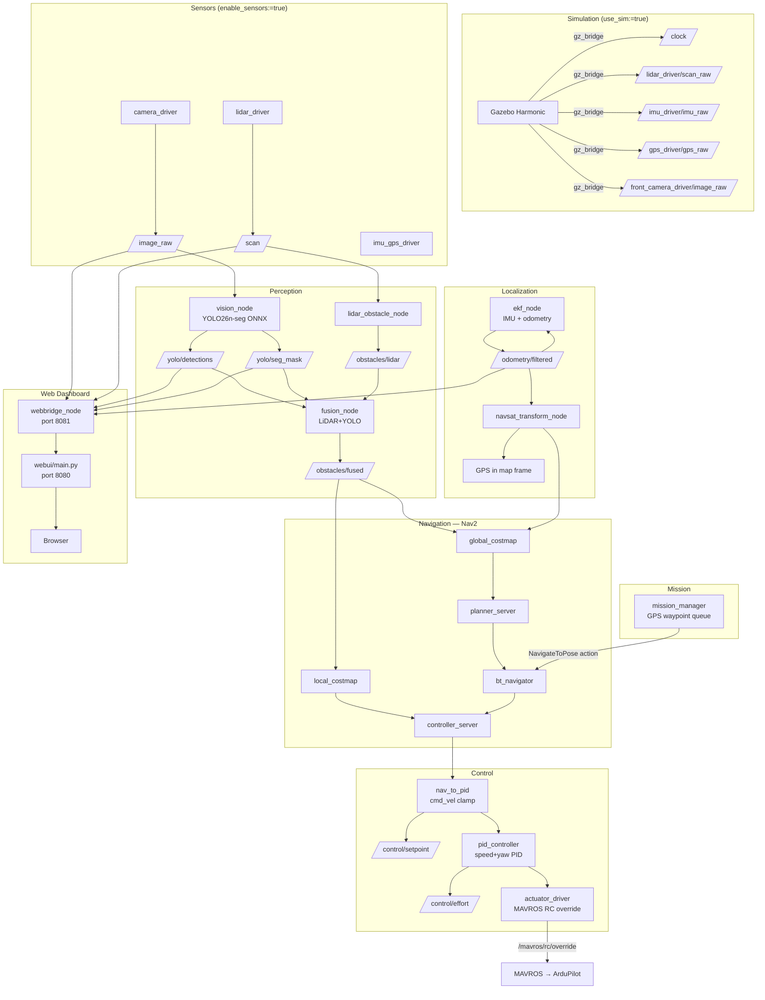

# Njord 2026

ROS 2 Jazzy autonomous surface vessel (ASV) stack for the [NODE Engineering Club](https://github.com/NODE-Engineering-Club) competition robot **Asket**.

## Getting Started

**Prerequisites (one-time install):**
1. [VSCode](https://code.visualstudio.com/)
2. [Docker Desktop](https://www.docker.com/products/docker-desktop/) — Windows / macOS. On Linux, Docker Engine or Podman works.
   - Linux/Podman: set `"dev.containers.dockerPath": "podman"` in VSCode user settings.
3. VSCode extension: [Dev Containers](https://marketplace.visualstudio.com/items?itemName=ms-vscode-remote.remote-containers)

**To start developing:**
1. Open this folder in VSCode
2. Click **Reopen in Container** when prompted (or `Ctrl+Shift+P` → *Dev Containers: Reopen in Container*)
3. First launch takes ~5 minutes to build. After that it's instant.

The `postCreateCommand` runs `colcon build --symlink-install` automatically and sources the workspace.

**Run the full stack (hardware):**
```bash
ros2 launch bringup njord.launch.py
```

**Run in simulation (Gazebo Harmonic):**
```bash
ros2 launch bringup njord.launch.py \
  use_sim:=true \
  enable_sensors:=false \
  enable_mavros:=false
```

This launches Gazebo with `basicWorld.sdf`, spawns the Asket URDF, bridges the sim clock, and runs the full navigation/control/mission stack against simulated sensor topics.

**Rebuild after adding new files** (`--symlink-install` means code edits don't need a rebuild for Python packages):
```bash
colcon build --symlink-install
source install/setup.bash
```

## Launch Arguments

| Argument | Default | Description |
|---|---|---|
| `use_sim` | `false` | Enable Gazebo, sim clock, gz_bridge |
| `enable_mavros` | `true` | MAVROS FCU bridge (ArduPilot) |
| `enable_localization` | `true` | EKF + NavSat transform |
| `enable_nav2` | `true` | Full Nav2 stack |
| `enable_sensors` | `true` | Camera, LiDAR, IMU/GPS drivers |
| `enable_perception` | `true` | LiDAR obstacle node + fusion |
| `enable_control` | `true` | nav_to_pid, PID, actuator driver |
| `enable_mission` | `true` | GPS waypoint sequencer |
| `enable_vision` | `true` | YOLO inference node |
| `enable_foxglove` | `true` | Foxglove WebSocket bridge (port 8765) |
| `enable_webbridge` | `true` | Web dashboard HTTP bridge (port 8081) |
| `vision_confidence` | `0.5` | YOLO detection confidence threshold |
| `camera_device` | `/dev/video0` | Camera device path |
| `lidar_device` | `/dev/ttyUSB0` | LiDAR serial device path |

## Workspace Layout

```
src/
├── description/    # URDF (asket.urdf.xacro), meshes, Gazebo world
├── sensors/        # camera_driver, lidar_driver, imu_gps_driver
├── perception/     # lidar_obstacle_node, fusion_node
├── control/        # nav_to_pid, pid_controller, actuator_driver
├── mission/        # mission_manager (GPS waypoint sequencer)
├── vision/         # vision_node (YOLO26n-seg ONNX inference)
├── webbridge/      # HTTP bridge exposing ROS topics to the web dashboard
└── bringup/        # njord.launch.py + config/
    └── config/
        ├── ekf.yaml          # robot_localization EKF params
        ├── navsat.yaml       # NavSat transform params
        ├── nav2_params.yaml  # Nav2 planner/controller/costmap params
        └── gz_bridge.yaml    # Gazebo ↔ ROS topic bridges
models/             # ONNX weights (bind-mounted, gitignored)
webui/              # Web dashboard served on the Raspberry Pi (port 8080)
scripts/
├── init.sh         # One-time Pi setup (run once as sudo)
└── deploy-pi.sh    # Deploy latest image + webui to the Pi over SSH
```

## Web Dashboard

A live operator dashboard is served directly on the Raspberry Pi at **port 8080**. It shows all sensor streams in one browser tab without needing Foxglove or any external tool.

![Dashboard panels: camera feed with YOLO boxes, segmentation mask, LiDAR polar plot, GPS map]

| Panel | Data source |
|---|---|
| Camera feed + YOLO bounding boxes | `/image_raw` + `/yolo/detections` |
| Segmentation mask | `/yolo/seg_mask` |
| LiDAR top-down polar plot | `/scan` |
| GPS map (Leaflet) | BlueOS MAVLink2REST API |
| Header: heading, speed, X/Y | `/odometry/filtered` |

Status chips in the header (CAM / SEG / LIDAR / GPS / ODOM) turn green when live data is flowing, so you can tell at a glance which sensors are active.

### How to open the dashboard

**After running `init.sh`** — the dashboard starts automatically on boot. Just open a browser:

```
http://boat.local:8080
```

If mDNS (`boat.local`) doesn't resolve, use the Pi's IP address directly:

```
http://192.168.x.x:8080
```

**To check service status on the Pi:**

```bash
sudo systemctl status njord-webui.service
sudo systemctl status njord.service
sudo systemctl status blueos.service
```

**To start or restart a service manually:**

```bash
sudo systemctl start njord-webui.service
sudo systemctl restart njord-webui.service
```

**To view live logs:**

```bash
sudo journalctl -u njord-webui.service -f
sudo journalctl -u njord.service -f
```

### How it works

```
Browser → port 8080 (webui/main.py, runs on Pi host)
              │
              ├── /api/gps         → BlueOS MAVLink2REST :6040  (GPS fix)
              │
              └── /api/camera      ┐
                  /api/seg         │  → webbridge_node :8081
                  /api/lidar       │     (runs inside njord container)
                  /api/odom        │     subscribes to ROS topics
                  /api/detections  ┘     converts to JPEG / JSON
```

The `webbridge_node` runs inside the Njord Docker container alongside the rest of the ROS stack. Because the container uses `--network host`, port 8081 is directly reachable from the Pi host. `webui/main.py` is a plain Python server on the host that proxies those endpoints to the browser.

### Running the dashboard manually (without init.sh)

Open two terminals on the Pi:

**Terminal 1 — build first (required after adding webbridge for the first time):**
```bash
colcon build --symlink-install
source install/setup.bash
```

**Then start the ROS stack:**
```bash
ros2 launch bringup njord.launch.py
```

**Terminal 2 — start the web server:**
```bash
python3 ~/node-ros-2026/webui/main.py
```

Then open `http://localhost:8080` or `http://boat.local:8080` in a browser.

To run the dashboard without hardware (webbridge + GPS only, no LiDAR/camera):
```bash
ros2 launch bringup njord.launch.py \
  enable_mavros:=false \
  enable_sensors:=false \
  enable_perception:=false \
  enable_control:=false \
  enable_mission:=false \
  enable_nav2:=false \
  enable_localization:=false
```

## Architecture



## Key Topics

| Topic | Type | Direction | Description |
|---|---|---|---|
| `/scan` | `sensor_msgs/LaserScan` | in | LiDAR scan |
| `/image_raw` | `sensor_msgs/Image` | in | Camera frame (BGR8 640×480) |
| `/imu/data` | `sensor_msgs/Imu` | in | IMU data |
| `/gps/fix` | `sensor_msgs/NavSatFix` | in | GPS fix |
| `/clock` | `rosgraph_msgs/Clock` | in (sim) | Simulation clock |
| `/yolo/detections` | `vision_msgs/Detection2DArray` | out | YOLO detections |
| `/yolo/seg_mask` | `sensor_msgs/Image` | out | Instance segmentation mask |
| `/obstacles/lidar` | `sensor_msgs/PointCloud2` | out | Raw LiDAR obstacles |
| `/obstacles/fused` | `sensor_msgs/PointCloud2` | out | LiDAR+YOLO fused obstacles |
| `/odometry/filtered` | `nav_msgs/Odometry` | out | EKF-fused odometry |
| `/cmd_vel` | `geometry_msgs/Twist` | Nav2→control | Nav2 velocity command |
| `/control/setpoint` | `geometry_msgs/Twist` | out | Clamped speed/yaw setpoint |
| `/control/effort` | `geometry_msgs/Twist` | out | PID output |
| `/mavros/rc/override` | `mavros_msgs/OverrideRCIn` | out | RC channels to ArduPilot |

## Node Reference

### `description`
- **`asket.urdf.xacro`** — Full robot URDF with hull, propellers, LiDAR, cameras, GPS, IMU, and PX4 mount. Includes Gazebo sensor plugins (camera, GPU LiDAR, NavSat, IMU).
- **`worlds/basicWorld.sdf`** — Minimal Gazebo Harmonic world with Physics, UserCommands, SceneBroadcaster, Sensors (camera+lidar), IMU, and NavSat system plugins.

### `sensors`
- **`camera_driver`** — OpenCV camera capture → `/image_raw`. Starts in degraded mode if no camera connected.
- **`lidar_driver`** — Serial LiDAR → `/scan` (`sensor_msgs/LaserScan`).
- **`imu_gps_driver`** — Relays MAVROS IMU (`/mavros/imu/data`) and GPS (`/mavros/global_position/raw/fix`) to standard topic names.

### `perception`
- **`lidar_obstacle_node`** — Converts `/scan` → `/obstacles/lidar` (PointCloud2). Filters returns beyond 10 m.
- **`fusion_node`** — Fuses LiDAR point cloud with YOLO segmentation mask via TF projection. Points confirmed by mask get a class label; unmatched YOLO detections at range get a bearing estimate at 5 m. Publishes `/obstacles/fused`.

### `vision`
- **`vision_node`** — YOLO26n-seg ONNX Runtime inference (CPU). Publishes `Detection2DArray` and an instance mask image. Confidence threshold configurable via `vision_confidence` launch arg.

### `control`
- **`nav_to_pid`** — Clamps Nav2 `/cmd_vel` to safe speed (≤2 m/s) and yaw rate (≤1 rad/s), republishes as `/control/setpoint`.
- **`pid_controller`** — Dual PID (speed + yaw) driven by `/control/setpoint` and IMU feedback. Publishes `/control/effort`.
- **`actuator_driver`** — Maps `Twist` effort to MAVROS `OverrideRCIn` RC channels (ch1=steering, ch3=throttle, ±400 µs around 1500 µs centre).

### `mission`
- **`mission_manager`** — Sequences hardcoded `(lat, lon)` waypoints through Nav2's `NavigateToPose` action. Converts GPS → map frame via `robot_localization/FromLL`.

### `webbridge`
- **`webbridge_node`** — Subscribes to camera, LiDAR, YOLO, and odometry topics. Converts ROS messages to JPEG frames and JSON, and serves them on port 8081 via a background HTTP thread. The `webui/main.py` host process proxies these to the browser on port 8080.

### `bringup`
- **`njord.launch.py`** — Single launch file for the entire stack with per-subsystem enable flags and sim/hardware switching.
- **`ekf.yaml`** — 2D EKF fusing IMU yaw + angular velocity with wheel odometry (if available).
- **`navsat.yaml`** — NavSat transform configured for zero-altitude, Cartesian output, no magnetic declination.
- **`nav2_params.yaml`** — Regulated Pure Pursuit controller, NavFn planner, obstacle costmaps fed by `/obstacles/fused`.

## Simulation Details

Gazebo Harmonic (Sim 8) integration via `ros_gz_bridge` and `ros_gz_sim`:

- World name: `default` (in `basicWorld.sdf`)
- Robot spawned via `ros2 run ros_gz_sim create -file asket.urdf -world default` with a 5 s delay to let Gazebo load
- Clock bridged: `gz.msgs.Clock` → `/clock` (`rosgraph_msgs/Clock`)
- Sensor topics published by Gazebo directly to their driver topic names (e.g. `/lidar_driver/scan_raw`, `/imu_driver/imu_raw`)

**Sensor plugins active in sim:**

| Sensor | Gazebo plugin | Topic |
|---|---|---|
| GPU LiDAR | `gz-sim-sensors-system` | `/lidar_driver/scan_raw` |
| Front camera | `gz-sim-sensors-system` | `/front_camera_driver/image_raw` |
| Back camera | `gz-sim-sensors-system` | `/back_camera_driver/image_raw` |
| IMU | `gz-sim-imu-system` | `/imu_driver/imu_raw` |
| GPS/NavSat | `gz-sim-navsat-system` | `/gps_driver/gps_raw` |

## Debugging

Run only the subsystems you care about:

```bash
# Vision only — no hardware required
ros2 launch bringup njord.launch.py \
  enable_mavros:=false \
  enable_localization:=false \
  enable_nav2:=false \
  enable_control:=false \
  enable_mission:=false \
  enable_perception:=false

# Perception pipeline only
ros2 launch bringup njord.launch.py \
  enable_mavros:=false \
  enable_localization:=false \
  enable_nav2:=false \
  enable_control:=false \
  enable_mission:=false

# Web dashboard only (no hardware — webbridge + GPS proxy)
ros2 launch bringup njord.launch.py \
  enable_mavros:=false \
  enable_sensors:=false \
  enable_perception:=false \
  enable_control:=false \
  enable_mission:=false \
  enable_nav2:=false \
  enable_localization:=false
```

Useful commands:

```bash
ros2 topic list                    # see all active topics
ros2 topic echo /yolo/detections   # stream YOLO detections
ros2 topic hz /obstacles/fused     # check fusion rate
ros2 topic hz /odometry/filtered   # check EKF rate
ros2 node list                     # confirm all nodes are running
```

## Production Deploy

### First-time setup on a fresh Raspberry Pi

Run this **once** from your laptop. It installs Podman, sets up BlueOS, deploys the Njord container, installs the web dashboard, and configures all three as systemd services that start on boot:

```bash
# From your laptop (requires sshpass: sudo apt install sshpass)
bash scripts/deploy-pi.sh pi@boat.local
```

Or SSH into the Pi and run directly:

```bash
sudo bash init.sh
```

After the Pi reboots, all services start automatically. Open the dashboard at:

```
http://boat.local:8080
```

### Subsequent deploys (after code changes)

```bash
bash scripts/deploy-pi.sh pi@boat.local
```

This re-runs `init.sh` over SSH, pulling the latest container image and redeploying the webui files.

### Service management on the Pi

| Task | Command |
|---|---|
| Check all service status | `sudo systemctl status blueos njord njord-webui` |
| Restart the web dashboard | `sudo systemctl restart njord-webui` |
| Restart the ROS stack | `sudo systemctl restart njord` |
| View web dashboard logs | `sudo journalctl -u njord-webui -f` |
| View ROS stack logs | `sudo journalctl -u njord -f` |
| View BlueOS logs | `sudo journalctl -u blueos -f` |
| Stop everything | `sudo systemctl stop njord njord-webui blueos` |

### Service startup order

```
boot
 └── blueos.service        (BlueOS + MAVLink2REST on :6040)
      └── njord.service     (ROS stack + webbridge_node on :8081)
           └── njord-webui.service  (web dashboard proxy on :8080)
```
