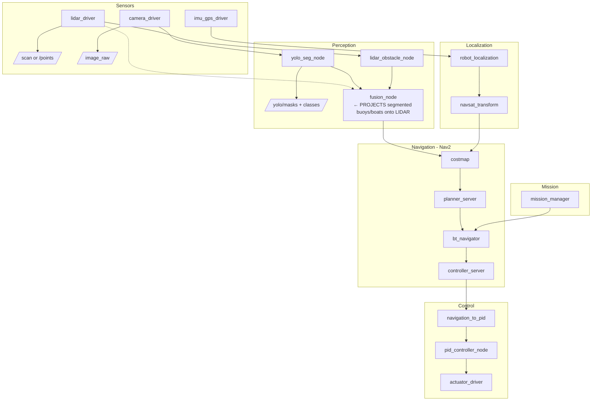

# Node

## Getting Started

**Prerequisites (one-time install):**
1. [VSCode](https://code.visualstudio.com/)
2. [Docker Desktop](https://www.docker.com/products/docker-desktop/) — Windows / macOS. On Linux, Docker Engine or Podman works too.
3. VSCode extension: [Dev Containers](https://marketplace.visualstudio.com/items?itemName=ms-vscode-remote.remote-containers)

**To start developing:**
1. Open this folder in VSCode
2. Click **Reopen in Container** when prompted (or `Ctrl+Shift+P` → *Dev Containers: Reopen in Container*)
3. First time takes ~5 minutes to build. After that it's instant.

That's it. You'll have a full ROS 2 environment with linting, autocomplete, and all entry points available. Open the integrated terminal and run the stack:

```bash
ros2 launch /workspace/launch/njord.launch.py
```

## Architecture


