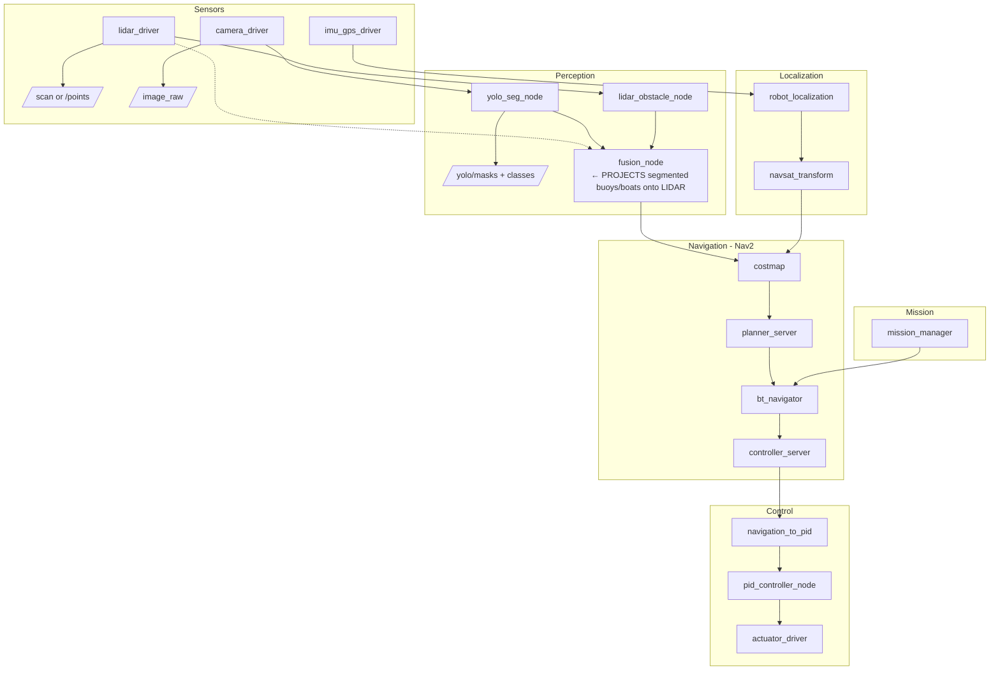

# Node

## Architecture

```mermaid
flowchart TD
    subgraph Sensors
        L[lidar_driver] --> Scan[/scan or /points/]
        C[camera_driver] --> Image[/image_raw/]
        I[imu_gps_driver]
    end

    subgraph Perception
        Y[yolo_seg_node] --> Det[/yolo/masks + classes/]
        O[lidar_obstacle_node]
        F[fusion_node<br/>← PROJECTS segmented buoys/boats onto LIDAR]
    end

    subgraph Localization
        RL[robot_localization]
        NT[navsat_transform]
    end

    subgraph Navigation[Navigation - Nav2]
        CM[costmap]
        PS[planner_server]
        CS[controller_server]
        BT[bt_navigator]
    end

    subgraph Control
        N2P[navigation_to_pid]
        PID[pid_controller_node]
        ACT[actuator_driver]
    end

    subgraph Mission
        MM[mission_manager]
    end

    C --> Y
    L --> O
    L -.-> F
    Y --> F
    O --> F
    F --> CM
    I --> RL
    RL --> NT
    NT --> CM
    CM --> PS
    PS --> BT
    BT --> CS
    CS --> N2P
    N2P --> PID
    PID --> ACT
    MM --> BT 
```
