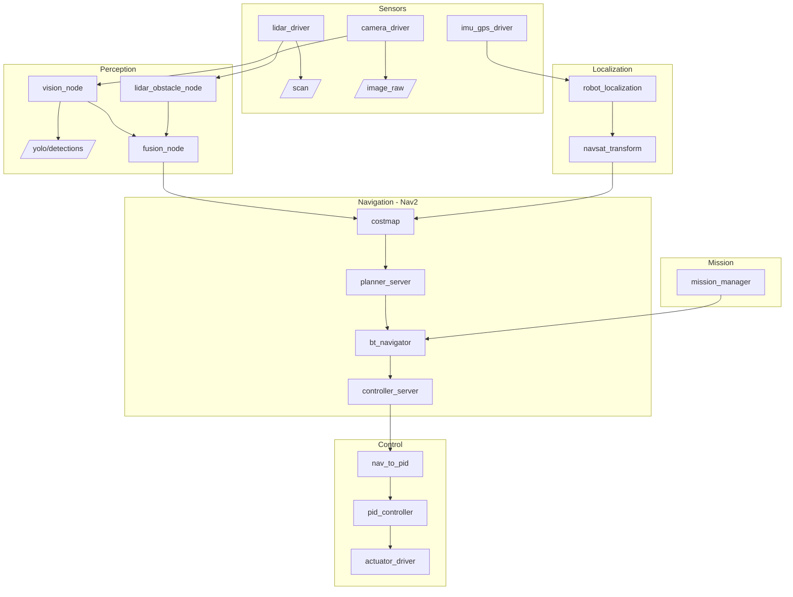

# Njord 2026

ROS 2 Jazzy autonomous surface vessel (USV) stack.

## Getting Started

**Prerequisites (one-time install):**
1. [VSCode](https://code.visualstudio.com/)
2. [Docker Desktop](https://www.docker.com/products/docker-desktop/) — Windows / macOS. On Linux, Docker Engine or Podman works.
   - Linux/Podman: set `"dev.containers.dockerPath": "podman"` in VSCode user settings.
3. VSCode extension: [Dev Containers](https://marketplace.visualstudio.com/items?itemName=ms-vscode-remote.remote-containers)

**To start developing:**
1. Open this folder in VSCode
2. Click **Reopen in Container** when prompted (or `Ctrl+Shift+P` → *Dev Containers: Reopen in Container*)
3. First time takes ~5 minutes to build. After that it's instant.

The `postCreateCommand` automatically runs `colcon build --symlink-install` and `source install/setup.bash` is added to the shell, so everything is ready on first open.

> **Camera:** if no camera is connected, the camera driver starts in degraded mode and the rest of the stack still works.

**Run the full stack:**
```bash
ros2 launch bringup njord.launch.py
```

**Run with selective subsystems disabled (e.g. no FCU, no Nav2):**
```bash
ros2 launch bringup njord.launch.py enable_mavros:=false enable_localization:=false enable_nav2:=false
```

**Rebuild after adding new files** (`--symlink-install` means code edits don't need a rebuild):
```bash
colcon build --symlink-install
source install/setup.bash
```

## Debugging

Run only the subsystems you care about by disabling everything else:

```bash
# Camera + vision only
ros2 launch bringup njord.launch.py \
  enable_mavros:=false \
  enable_localization:=false \
  enable_nav2:=false \
  enable_control:=false \
  enable_mission:=false \
  enable_perception:=false 
```

Then in a separate terminal:

```bash
# See what's publishing
ros2 topic list

# Stream detections
ros2 topic echo /yolo/detections

# Check frame rate
ros2 topic hz /yolo/detections
```

## Workspace layout

```
src/
├── asket_description/ # URDF — robot frame tree (base_link, lidar, camera)
├── sensors/      # camera_driver, lidar_driver, imu_gps_driver
├── perception/   # lidar_obstacle_node, fusion_node
├── control/      # nav_to_pid, pid_controller, actuator_driver
├── mission/      # mission_manager
├── vision/       # vision_node (YOLO ONNX inference)
└── bringup/      # launch/njord.launch.py + config/
models/           # ONNX weights (bind-mounted, gitignored)
```

## Architecture



## Production deploy

```bash
bash scripts/deploy-pi.sh
```

This SSHes into `pi@boat.local`, pulls the latest image from GHCR, sets up systemd services for BlueOS and Njord, and reboots. On every subsequent reboot the Pi pulls the latest image automatically before starting.

## Simulation (Gazebo)

The stack is simulation-ready. All nodes accept `use_sim_time` and the sensor drivers can be disabled so a simulator can provide sensor data on the same topics.

**Topic interfaces the simulator must publish:**

| Topic | Type | Description |
|---|---|---|
| `/scan` | `sensor_msgs/LaserScan` | LIDAR scan |
| `/image_raw` | `sensor_msgs/Image` | Camera frame (bgr8, 640×480) |
| `/imu/data` | `sensor_msgs/Imu` | IMU at ≥50 Hz |
| `/mavros/global_position/raw/fix` | `sensor_msgs/NavSatFix` | GPS fix |
| `/clock` | `rosgraph_msgs/Clock` | Sim clock |

**Robot description:**

The URDF is in `src/asket_description/urdf/asket.urdf.xacro`. Extend it with Gazebo sensor plugins, inertial properties, and collision geometry for your sim environment.

**Launch for simulation:**

```bash
ros2 launch bringup njord.launch.py \
  use_sim:=true \
  enable_sensors:=false \
  enable_mavros:=false
```

All perception, fusion, Nav2, control, and mission nodes will run using the simulator's clock and sensor topics.
